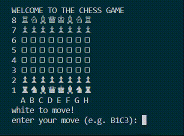

### Chess Game
## General Info
This project is my second, ongoing step in learning Python. Its present version is a simple, terminal Chess Game for 2 players. I'm currently working on adding a basic Chess Engine to be able to play against the AI. Later I would like to develop the project as a mobile application.


## How To Play
```
$ python3 game.py

```